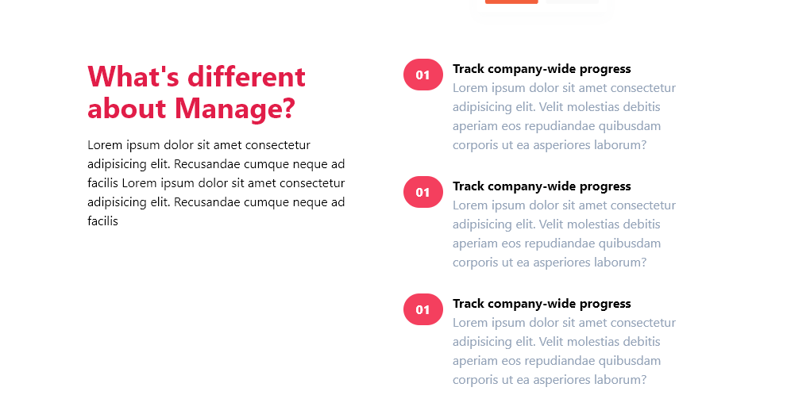
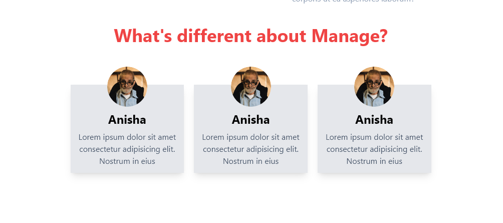

# Tailwind CSS Project README

Welcome to the [Your Project Name] project! This README will provide you with an overview of the project, how to use Tailwind CSS, and how to include images in your documentation.

## Table of Contents

1. [Project Overview](#project-overview)
2. [Getting Started](#getting-started)
3. [Usage](#usage)
4. [Including Images](#including-images)
5. [Contributing](#contributing)
6. [License](#license)

## Project Overview

This project demonstrates the use of tailwind. How to build a responsive page using the most popular CSS framework!

## Getting Started

To get started with this project, follow these steps:

1. Clone this repository to your local machine:

   ```bash
   git clone https://github.com/hsuntariq/tailwind_landing_page.git
2. Install node modules

    ```bash
    npm install
3. set up a constant watch to compile your tailwind classes, script is alredy written in the the package.json
    ```bash
    npm run watch
4. Start coding !!!


## Project Display






